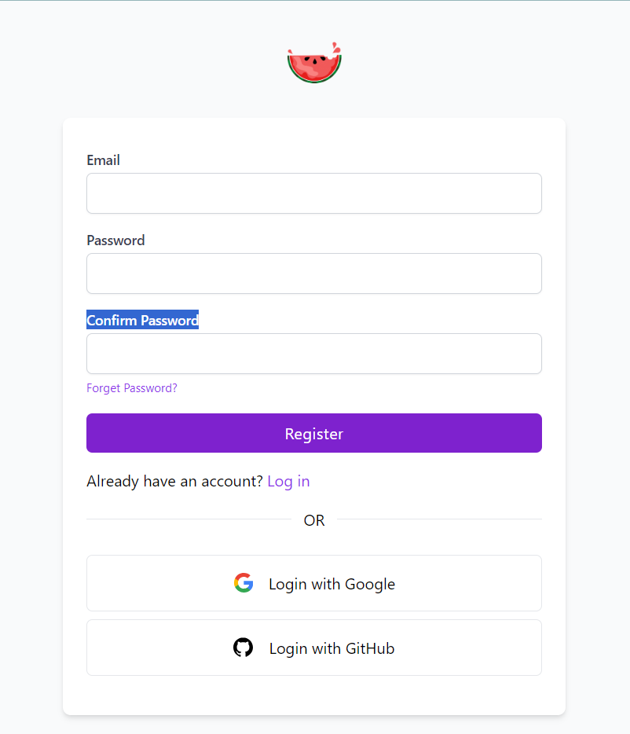

# Twitter Clone

This is a Twitter clone app built with React, JSX, and Firebase.

## Features

- Authentication with GitHub, Google, and email/password
- Realtime tweets and notifications using Firebase
- Like and reply to tweets
- User profiles

## Usage

### Install

```
npm install
```

### Run locally

```
npm start
```

App will run on http://localhost:3000




## Stack

- React - Frontend framework
- JSX - Markup syntax
- Firebase and Firestore - Backend database and authentication
- Tailwind CSS - Styling

## Firebase Setup

This app uses Firebase for authentication and realtime data. You'll need to create a Firebase project and copy your config into `firebaseConfig.js`.

Enable the following Firebase products:

- Authentication
- Firestore Database
- Storage

See Firebase docs for setup details.

## Contributing

Pull requests are welcome. Feel free to open an issue for any bugs or feature requests.

## License

This project is open source and available under the [MIT License](LICENSE).

Let me know if you would like me to explain or expand on any part of the README!

##Thanks

@hiravesonali
